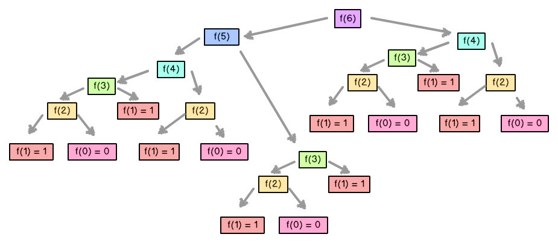

# Dynamic Programming

**Dynamic Programming (DP)** คือการแก้ปัญหาที่มีลักษณะคล้าย ๆ การเขียนฟังก์ชัน brute force ที่มีการ return คำตอบ เพียงแต่อาศัยคุณสมบัติพิเศษของปัญหา เพื่อทำให้การคิดคำนวณทำได้ไวขึ้น หลัก ๆ แล้วมีสองอย่าง ได้แก่

1. **Optimal Substructure** หากสร้างคำตอบของปัญหาใหญ่ได้ คำตอบของปัญหาย่อยย่อมดีที่สุดด้วย
2. **Overlapping Subproblems** ปัญหาใหญ่สามารถแบ่งเป็นปัญหาย่อยต่าง ๆ ได้ แล้วปัญหาย่อยต่าง ๆ หากแบ่งออกไปอีก อาจจะแบ่งได้ปัญหาย่อยที่ซ้ำกัน

ถ้าเจอปัญหาซ้ำกัน เราไม่จำเป็นต้องคิดคำตอบซ้ำ ทำให้สามารถคำนวณคำตอบของปัญหาทั้งหมดได้เร็วขึ้น เทคนิค Dynamic Programming นี้สามารถนำไปใช้ได้กับ Optimization Problem, Counting Problem และในบางครั้ง โจทย์แนว constructive อีกด้วย

**Fibonacci Numbers**

ตัวอย่างที่ง่ายที่สุดคือการหาตัวเลข Fibonacci ตัวที่ `n` โดยตัวเลข Fibonacci มีนิยามดังนี้

```
F[0] = F[1] = 1
F[n] = F[n-1] + F[n-2]
```

ปกติแล้ว หากเขียนเป็น recursive function จะได้โค้ดดังนี้

```cpp
int fibonacci(int n) {
    if (n == 0 || n == 1)
        return 1;
    return fibonacci(n-1) + fibonacci(n-2);
}
```

พิจารณารูปด้านล่าง สังเกตได้ว่าหากคำนวณโดยใช้ recursive function จะมีค่า `F[i]` บางค่าที่ถูกคำนวณซ้ำ รวมแล้วพบว่าจะใช้เวลาในการทำงานเป็น `O(2^n)` อีกด้วย (ประมาณได้จากการที่แต่ละ node จะต้องแตกออกเป็น 2 node - เนื่องจากมีทั้งหมด `n` node จึงใช้เวลามากประมาณ `O(2^n)`)



หัวข้อถัดไป จะกล่าวถึงวิธีการหลีกเลี่ยงการคิดข้อมูลซ้ำ ทำให้สามารถแก้ปัญหา Fibonacci ได้ในเวลา `O(n)`

## Top-down Dynamic Programming (Memoization)

หนึ่งในวิธีการหลีกเลี่ยงการคิดคำนวณซ้ำคือการทำ memoization

นั่นคือ การเขียนฟังก์ชัน recursive ที่ใส่ break condition เพิ่มเติม โดยตรวจสอบว่าเคยเข้าถึง state นั้นหรือยัง หากพบว่าเคยเข้าถึง state นั้นแล้ว ก็จะ return คำตอบที่เคยคำนวณไว้ทันทีเลย

สังเกตว่าเราจะเรียกฟังก์ชันเพื่อแก้ปัญหาใหญ่ก่อน แล้วฟังก์ชันนั้นจะเรียกตนเองแบบ recursive เพื่อแก้ปัญหาย่อยเรื่อย ๆ ดังนั้นวิธีการ implement DP แบบดังกล่าวจึงเรียกว่าเป็นแบบ Top-down

ตามตัวอย่างการคำนวณค่า Fibonacci โค้ดจะมีลักษณะดังนี้

```cpp
int F[N];
bool visited[N];

int fibonacci(int n) {
    if (n == 0 || n == 1)
        return 1;
    if (visited[n]) // return if already computed
        return F[n];
    visited[n] = true; // set as "already computed"
    F[n] = fibonacci(n-1) + fibonacci(n-2); // remember answer
    return F[n];
}
```

สังเกตว่าอัลกอริทึมดังกล่าวจะใช้เวลา `O(n)` เพราะการใส่ break condition ทำให้มี state เพียง `O(n)` state เท่านั้น สำหรับค่า `n` แต่ละค่า หากเราทราบคำตอบของค่า `n` ที่น้อยกว่าอยู่แล้ว จะสามารถคำนวณคำตอบได้ใน `O(1)` (นั่นคือนำคำตอบมาบวกกันเฉย ๆ)

อย่างไรก็ตาม การ implement แบบ top-down โค้ดอาจจะทำงานได้ช้า เนื่องจาก constant factor ในการจัดการการเรียกฟังก์ชันของระบบสูง

## Bottom-up Dynamic Programming

อีกวิธีที่คนมักใช้กันก็คือ Bottom-up ซึ่งเป็นการหาคำตอบของ state ที่อยู่ด้านล่างก่อน (ในกราฟของ state) โดยจะเริ่มจาก base case ที่รู้คำตอบอยู่แล้ว แล้วจะค่อย ๆ สร้างของ state ที่ใหญ่ขึ้นไปเรื่อย ๆ

โค้ดของ Fibonacci ที่ implement แบบ Bottom-up จะเป็นดังนี้

```cpp
int fibonacci(int n) {
    int F[n+1];
    F[0] = F[1] = 1;
    for (int i = 2; i <= n; i++)
        F[i] = F[i-1] + F[i-2];
    return F[n];
}
```

จะเห็นได้ชัดว่าอัลกอริทึมนี้ทำงานใน `O(n)` นอกจากนี้ยังทำงานได้ดีกว่าแบบ top-down เพราะไม่ต้องลำบากกับการเรียกฟังก์ชันแบบ recursive

ถึงอย่างไรก็ตาม การ implement แบบ bottom-up ไม่ได้ดีเสมอไป เพราะโจทย์บางข้อ เราอาจจะหาลำดับการคำนวณตาราง DP ได้ยาก หากใช้แบบ top-down แล้วปล่อยให้ระบบจัดการจนไปถึง base case เองจะสะดวกกว่า นอกจากนี้ โจทย์บางข้อเราไม่จำเป็นต้องคำนวณทุก state ที่เรานิยามไว้ ดังนั้นการ implement แบบ top-down ซึ่งจะเรียกเฉพาะ state ที่จำเป็นต้องใช้อาจจะทำงานได้เร็วกว่า ในการแข่งขัน ควรเลือกใช้วิธีที่เหมาะสมกับโจทย์

## Steps to solve Dynamic Programming problems

เราจะมาดูขั้นตอนในการแก้โจทย์ DP โดยจะใช้ปัญหา Coin Change เป็นตัวอย่าง

> กำหนดจำนวนเต็ม `n` แทนจำนวนประเภทของเหรียญ และ `k` แทนมูลค่าเงินที่ต้องการ มีลำดับ `C` โดยที่ `C[i]` แทนค่าของเหรียญประเภทที่ `i` - สมมุติให้เหรียญแต่ละประเภทมีจำนวนไม่จำกัด จงหาว่าจะต้องใช้เหรียญน้อยสุดกี่เหรียญจึงจะได้เงินรวมเท่ากับ `k` พอดี

สิ่งแรกที่เราต้องทำเมื่อเราคิดว่าโจทย์สามารถแก้ได้โดยใช้ Dynamic Programming คือสร้างสมการ recursive กำกับคำตอบ ถ้าเราสามารถสร้างสมการ recursive นี้ได้ เราก็สามารถใช้ Top-down หรือ Bottom-up เพื่อทำให้สามารถคำนวณได้รวดเร็ว

การสร้างสมการขึ้นมาเป็นสิ่งที่ต้องอาศัยการฝึกฝนอย่างสูง โดยเฉพาะข้อที่ยาก ๆ และต้องใช้สมการแปลก ๆ
อย่างไรก็ตาม มันจะง่ายขึ้นถ้าเราคิดตามสามขั้นตอนนี้

1. หาว่าเราควรจะกำหนด state อะไร และ state นั้นบ่งบอกถึงอะไร
2. หาว่า state นั้นจะสามารถสร้างคำตอบจาก state ใดได้บ้าง
3. หาว่าเราจะคำนวณคำตอบของ state นั้นจาก state อื่นอย่างไร

เราจะมาดูว่าเราจะสามขั้นตอนนี้ในการแก้ปัญหา coin change ได้อย่างไร

สำหรับโจทย์ Coin Change การกำหนด state สามารถทำได้โดยสังเกตว่าโจทย์กำหนดอะไรให้บ้าง หรือกำหนดให้หาอะไรบ้าง ในที่นี้ พบว่ามี

-   จำนวนประเภทของเหรียญ
-   มูลค่าเงินที่ต้องการ
-   มูลค่าของประเภทเหรียญแต่ละเหรียญ
-   จำนวนเหรียญที่น้อยสุดที่ต้องใช้ (สิ่งที่โจทย์ให้หา)

หากลองกำหนดให้ state ขึ้นอยู่กับจำนวนของเหรียญที่ต้องใช้ ก็อาจจะต้องสร้าง array `dp[i]` มาโดยที่ `i` แทนจำนวนเหรียญที่ใช้ หากลองกำหนดแบบนี้แล้ว เราต้องหาว่า `dp[i]` จะเก็บค่าอะไร ให้ลองพิจารณาไปตามลำดับ

-   อาจจะเก็บเป็นผลรวมน้อยสุดที่เป็นไปได้? ก็ไม่เกี่ยวข้องอะไรกับโจทย์ เพราะโจทย์กำหนดผลรวมให้ แต่ให้เราหาจำนวนเหรียญน้อยสุด
-   ผลรวมทั้งหมดที่เป็นไปได้? ก็อาจจะยุ่งยากเกินไป

สังเกตว่าการกำหนด state แบบนี้ไม่เหมาะสมมากนัก หากลองกำหนดให้ state ขึ้นอยู่กับมูลค่าของเงินที่ต้องการแทน เราก็สามารถกำหนดให้ `dp[i]` เท่ากับ จำนวนเหรียญที่น้อยที่สุดที่ต้องใช้เพื่อทำให้ได้มูลค่ารวม `i` บาท สังเกตว่่าการกำหนดแบบนี้จะตรงกับสิ่งที่โจทย์ต้องการให้หาพอดี หากเราต้องการเงิน `k` บาทก็สามารถตอบจาก `dp[k]` ได้เลย

สังเกตว่าถ้าเราต้องการเงิน `x` บาท เราอาจจะเลือกใช้เหรียญใดเหรียญหนึ่งก็ได้ เช่น หากเลือกใช้เหรียญ `C[i]` นั่นแปลว่า เรามี 1 เหรียญที่มีมูลค่า `C[i]` บาท และเงินอีก `x-C[i]` บาทที่ต้องพิจารณาหาว่าจะใช้เหรียญใด สังเกตว่าในส่วน `x-C[i]` นั้นเป็นปัญหาย่อยลักษณะเดียวกัน เราสามารถใช้ฟังก์ชัน recursive เพื่อคำนวณว่ามูลค่า `x-C[i]` ต้องใช้เหรียญน้อยสุดเท่าใด เนื่องจากว่าเราต้องการทอนเงิน `x` บาทโดยใช้จำนวนเหรียญน้อยที่สุดที่เป็นไปได้ เราต้องทดลองค่า `i` ตั้งแต่ `1` ถึง `n` เพื่อหาจำนวนเหรียญที่น้อยที่สุด

ดังนั้น สมการเวียนเกิดของ `dp` ของโจทย์ข้อนี้คือ

```
dp[0] = 0 // เงิน 0 บาท ไม่จำเป็นต้องใช้เหรียญ
dp[x] = min(dp[x-C[i]] + 1, 1 <= i <= n and C[i] <= x)
// มีเงิน x บาท หากสร้างจากการใช้เหรียญ C[i] ต้องพิจารณาแก้ปัญหากรณีที่มีเงิน x-C[i] บาทอีก แล้วมารวมกับเหรียญ C[i] 1 เหรยีญ ดังนั้น จะได้คำตอบรวมเป็น dp[x-C[i]] + 1
```

โดยที่ `x` คือราคาของใน state นั้นๆ และคำตอบสุดท้ายคือ `dp[k]`

ถ้าเราเขียน Top-down ก็จะได้โค้ดดังนี้

```cpp
int n, C[N], dp[N];
bool visited[N];

int coin_change(int x) {
    if (x == 0)
        return 0;
    if (visited[x])
        return dp[x];
    visited[x] = true;
    dp[x] = INF;
    for (int i = 1; i <= n; i++) {
        if (C[i] <= x)
            dp[x] = min(solve(x - C[i]) + 1, dp[x]);
    }
    return dp[x];
}
// answer: coin_change(k)
```

แต่ถ้าเราเขียนแบบ Bottom-up ก็จะเป็นแบบนี้

```cpp
int n, C[N], dp[N];
int coin_change(int k) {
    fill(dp, dp+N, INF);
    dp[0] = 0;
    for (int x = 1; x <= k; x++) {
        for (int i = 1; i <= n; i++) {
            if (C[i] <= x)
                dp[x] = min(dp[x - C[i]] + 1, dp[x]);
        }
    }
    return dp[k];
}
```

สังเกตว่า แต่ละ state เราต้องลูปค่า `i` เพื่อหาจำนวนเหรียญที่น้อยที่สุด ซึ่งมีค่า `i` ที่เป็นไปได้ `O(n)` แบบ เนื่องจากมีทั้งหมด `O(k)` state รวมแล้วจะใช้เวลา `O(nk)`

นอกจากนี้ปัญหา Coin Change อาจจะเปลี่ยนคำถาม แทนที่จะให้หาจำนวนเงินน้อยสุด อาจจะถามจำนวนลำดับวิธีการเลือกเหรียญให้มีมูลค่ารวม `k` บาทก็ได้ เช่น หาก `n = 2`, `C = [1, 2]` และ `k = 4` ก็จะได้ 5 รูปแบบดังนี้

-   4 = 1+1+1+1
-   4 = 1+1+2
-   4 = 1+2+1
-   4 = 2+1+1
-   4 = 2+2

ในที่นี้เราสามารถเปลี่ยนสมการเวียนเกิดเป็น

```
dp[0] = 1 // การทอนเงิน 0 บาทสามารถทำได้ 1 แบบคือไม่ใช่เหรียญเลย
dp[x] = sum(dp[x-C[i]], 1 <= i <= n and C[i] <= x)
// การทอนเงิน x บาท สามารถทำได้โดยเลือกเหรียญแรกที่จะใช้ก่อน สมมุติว่าเลือกเหรียญ C[i], แล้วพิจารณานับจำนวนวิธีที่จะทอนเงิน x-C[i] บาท
```

## Multi-dimensional DP

สังเกตว่าในตัวอย่างก่อนหน้า state `dp` ของเราจะเป็น array 1 มิติ แต่จริง ๆ แล้วหาก state ของเราต้องเก็บข้อมูลมากกว่านั้น เราอาจจะใช้ตาราง 2 มิติขึ้นไปก็ได้

**Maximum Value Monotonic Path**

> กำหนดตารางขนาด `n*m` ให้ โดยช่อง `A[i][j]` จะมีจำนวนเต็ม ให้หาเส้นทางเดินจากตำแหน่ง `(1, 1)` ซึ่งเป็นตำแหน่งมุมบนซ้าย มายังตำแหน่ง `(n, m)` ซึ่งเป็นตำแหน่งมุมล่างขวา โดยอนุญาตให้เดินขวาหรือลงเท่านั้น (ห้ามเดินขึ้นหรือซ้าย) เมื่อเดินเสร็จแล้วจะได้มูลค่าเท่ากับผลรวมของค่า `A[i][j]` ที่เดินผ่านทั้งหมด ถามว่ามูลค่าทางเดินที่มากที่สุดที่เป็นไปได้เท่ากับเท่าใด

สังเกตว่าโจทย์ข้อนี้ ตำแหน่งที่กำหนดให้มาเป็นตำแหน่ง 2 มิติ ดังนั้น เราอาจจะให้ฟังก์ชัน/state ของเรานิยามเป็นตาราง 2 มิติก็ได้ โดยกำหนดให้ `dp[i][j]` เมื่อ `1 <= i <= n` และ `1 <= j <= m` มีค่าเท่ากับ ผลรวมที่มากที่สุดที่เป็นไปได้ เมื่อเดินจากช่อง `(1, 1)` มาถึงช่อง `(i, j)`

สังเกตว่าการที่จะเดินมาถึงช่อง `(i, j)` ได้ เราจำเป็นต้องเดินมาถึงช่อง `(i-1, j)` ก่อนแล้วเดินลง หรือเดินมาถึงช่อง `(i, j-1)` ก่อนแล้วเดินขวา เราจะพิจารณาทั้งสองวิธีที่เป็นไปได้แล้วหาว่าวิธีใดให้ผลรวมมากกว่ากัน จะได้สมการเวียนเกิดดังนี้

```
dp[1][1] = A[1][1] // base case คือกรณีที่จุดเริ่มต้นตรงกับจุดจบ
dp[0][j] = dp[i][0] = -INF // ไม่อนุญาตให้เดินออกขอบ
dp[i][j] = max(dp[i-1][j], dp[i][j-1]) + A[i][j]
```

คำตอบสุดท้ายจะอยู่ที่ `dp[n][m]`

สังเกตว่ามี state ทั้งหมด `nm` state และแต่ละ state สามารถคำนวณคำตอบได้ใน constant time ดังนั้น รวมแล้วอัลกอริทึมนี้จะใช้เวลา `O(nm)`

```cpp
const int INF = 1e9;
for (int i = 1; i <= n; ++i)
    dp[i][0] = -INF;
for (int j = 1; j <= m; ++j)
    dp[0][j] = -INF;
for (int i = 1; i <= n; ++i) {
    for (int j = 1; j <= m; ++j) {
        if (i == 1 && j == 1)
            dp[i][j] = A[i][j];
        else
            dp[i][j] = max(dp[i-1][j], dp[i][j-1]) + A[i][j];
    }
}
// answer: dp[n][m]
```

นอกจากนี้ยังมีรูปแบบการกำหนด state อีกหลายแบบมาก ตั้งแต่หัวข้อ 2.4.5 เป็นต้นไป เราจะกล่าวถึงวิธีการกำหนด state หลาย ๆ แบบที่พบได้บ่อย ควรฝึกฝนไว้ก่อนเข้าแข่งขันจริง

## Prefix/Suffix Dynamic Programming

Prefix/Suffix DP เป็นการกำหนด state ในลักษณะที่สนใจเฉพาะส่วนต้นหรือส่วนปลายของปัญหาเท่านั้น เช่น ปัญหา Maximium Independent Set (MIS)

> กำหนดลำดับ `A[1..n]` ให้ ให้หาลำดับย่อย (subsequence) ที่มีผลรวมของสมาชิกมากที่สุด โดยสมาชิกแต่ละตัวของลำดับย่อยจะต้องไม่มีตำแหน่งติดกัน
>
> ตัวอย่าง กำหนดลำดับ `A` เป็น `3, 1, 4, 1, 2, 5` เราจะได้คำตอบเป็น `3, 4, 5` เพราะลำดับนี้มีผลรวมมากที่สุดคือ `3+4+5 = 12` และเลข `3`, `4`, `5` ไม่ได้อยู่ตำแหน่งติดกันในลำดับเดิม

เราสามารถนิยาม state ที่สนใจเฉพาะคำตอบของปัญหาส่วนต้น (prefix) เท่านั้นได้ กล่าวคือ กำหนดให้ `dp[i]` มีค่าเท่ากับ คำตอบที่มากที่สุดที่เป็นไปได้ หากสนใจเฉพาะส่วนลำดับ `A[1..i]` (ส่วน `A[i+1]` เป็นต้นไป ไม่พิจารณาในคำตอบ)

ในการคำนวณค่าของ `dp[i]` เราจะสนใจค่า ณ ตำแหน่ง `i` เป็นหลัก (นั่นคือ `A[i]`) แล้วตัดสินใจเลือกว่า จะรวม `A[i]` เข้าในคำตอบหรือไม่ หรือไม่รวม

-   ถ้าเลือกรวม `A[i]` เข้าในคำตอบ เราจะไม่สามารถเลือก `A[i-1]` ได้ เพราะจะอยู่ในตำแหน่งติดกัน ดังนั้น จะได้คำตอบเท่ากับ `dp[i-2] + A[i]` (อย่าลืมว่า `dp[i-2]` คือคำตอบของปัญหาย่อย)
-   ถ้าเลือก**ไม่**รวม `A[i]` เข้าในคำตอบ ก็เพียงแค่พิจารณาปัญหาที่เหลืออยู่ หลังตัดตัวที่ `i` ออกมาแล้ว นั่นคือ เราจะได้คำตอบเท่ากับ `dp[i-1]`

เนื่องจากเราต้องการคำตอบที่มากที่สุดที่เป็นไปได้ ดังนั้น `dp[i] = max(dp[i-2]+A[i], dp[i-1])` (อย่าลืมกำหนด base case - ในที่นี้อาจจะกำหนดให้ `dp[-1] = dp[0] = 0` เป็นต้น)

สังเกตว่าแนวทางการกำหนด state ดังกล่าวสนใจเฉพาะส่วนหน้าของปัญหา แต่ความจริงแล้วเราจะเปลี่ยนมาสนใจส่วนหลัง (suffix) ก็ได้ กล่าวคือ กำหนดให้ `dp[i]` เท่ากับคำตอบที่มากที่สุดที่เป็นไปได้ เมื่อพิจารณาลำดับ `A[i..n]` จะทำให้ได้ recurrence เป็น `dp[i] = max(A[i]+dp[i+2], dp[i+1])` และ base case เป็น `dp[n+1] = dp[n+2] = 0`

## LIS-style Dynamic Programming

ปัญหา Longest Increasing Subsequence (LIS) เป็นอีกปัญหาคลาสสิกที่พบได้บ่อย โจทย์ปัญหาเป็นดังนี้

> กำหนดลำดับ `A[1..n]` ให้ ให้หาลำดับย่อยที่มีความยาวมากที่สุด โดยสมาชิกในลำดับย่อยตัวที่ `i` จะต้องมีค่าน้อยกว่าสมาชิกตัวที่ `i+1` (กล่าวคือ เรียงจากน้อยไปมาก และไม่มีตัวเลขที่เท่ากัน)
>
> ตัวอย่าง ลำดับ `1, 2, 6, 3, 5, 7, 4, 8` มีลำดับย่อยที่ยาวที่สุดที่เป็นไปได้คือ `1, 2, 3, 5, 7, 8` ซึ่งมีความยาวเท่ากับ 6

หากเราพยายามนิยาม state dp คล้าย ๆ ปัญหา Maximum Independent Set กล่าวคือ `dp[i]` เท่ากับ ความยาวสูงสุดของลำดับย่อย เมื่อพิจารณาเฉพาะลำดับ `A[1..i]` จะพบว่าเราไม่สามารถหา recurrence ได้ เพราะตัว state ไม่ได้ให้ข้อมูลเกี่ยวกับตัวเลขในลำดับเลย ทำให้เราไม่ทราบว่าเราจะบังคับเงื่อนไข "น้อยไปมาก" ได้อย่างไร

หากเราเปลี่ยนนิยามเป็น `dp[i]` เท่ากับ ความยาวสูงสุดของลำดับย่อย**ที่มาจบที่ตำแหน่ง `i` พอดี** (ให้ `dp[0] = 0` เพราะไม่มีทางที่ลำดับย่อยจะจบก่อนหน้าตัวแรกได้) จะพบว่า เราสามารถหา recurrence ได้อย่างง่ายดาย

เนื่องจากนิยามของเราบังคับว่าต้องจบที่ตำแหน่ง `i` ยังไงเราต้องมี `A[i]` เป็นตัวสุดท้ายของลำดับย่อยแน่ ๆ สิ่งที่เราต้องเลือกคือเลือกว่าตัวก่อนหน้าในลำดับมีอะไรบ้าง ในที่นี้เราอาจจะแก้ปัญหา `dp` ส่วนก่อนหน้าไว้ก่อน แล้วเลือกว่าจะนำลำดับที่จบที่ตำแหน่งก่อนหน้าตำแหน่งใด มาต่อกับตำแหน่ง `i`

สมมุติว่าจะเลือกลำดับที่จบที่ตำแหน่ง `j` อยู่ (`0 <= j < i`) เราจะเลือกได้ก็ต่อเมื่อ `A[j] < A[i]` เท่านั้น หากเลือกได้ เราจะได้ลำดับที่มีความยาวเป็น `dp[j]+1` (คือ ลำดับที่มาจบที่ตำแหน่ง `j` แล้วเพิ่มตัวที่ `i` เข้าไปต่อท้าย)

ดังนั้น เราสามารถเขียนสมการเวียนเกิดได้ ดังนี้

```
dp[0] = 0
dp[i] = max(dp[j]+1, 0 <= j < i and A[j] < A[i])
```

เนื่องจากปัญหา LIS ต้องการลำดับที่จบ ณ ตำแหน่งใดก็ได้ ดังนั้น คำตอบของเราจะเท่ากับ `max(dp[i], 1 <= i <= n)`

นอกจากปัญหา Longest Increasing Subsequence แล้ว ยังมีปัญหาอื่นที่สามารถใช้แนวคิดคล้าย ๆ กันได้อีกด้วย เช่น ปัญหา Maximum Sum Subarray

> กำหนดลำดับ `A[1..n]` (อาจมีตัวเลขติดลบ) ให้เลือกค่า `i`, `j` โดยที่ `1 <= i <= j <= n` ที่ทำให้ `sum(A[i..j])` มากที่สุดที่เป็นไปได้ กล่าวคือ ให้เลือกช่วงย่อยของลำดับที่มีผลรวมมากที่สุด

เราอาจจะนิยามให้ `dp[i]` เท่ากับ ผลรวมที่มากที่สุดที่เป็นไปได้ เมื่อพิจารณาเฉพาะช่วงย่อยที่มาจบที่ตำแหน่ง `i` พอดี สังเกตว่าเราต้องมี `A[i]` อยู่ในช่วงอยู่แล้ว ตามนิยาม สิ่งที่เราเลือกได้คือ เราจะนำมาต่อกับช่วงก่อนหน้า (`dp[i-1]`) หรือไม่ เราต้องการวิธีที่ทำให้ได้ผลรวมมากที่สุด ดังนั้น `dp[i] = max(A[i], A[i]+dp[i-1])` (base case อาจจะกำหนดให้ `dp[1] = A[1]`)

## Substring Dynamic Programming

โจทย์บางข้อ เราไม่สามารถสนใจเพียงแค่ส่วน prefix/suffix แต่ต้องสนใจทุก substring ที่เป็นไปได้ ยกตัวอย่างโจทย์ดังนี้

> มีลำดับ `A[1..n]` เราสามารถเลือกแบ่งลำดับนี้ออกเป็นสองส่วน ซ้าย-ขวา ได้ เช่น แบ่งเป็นลำดับ `A[1..i]` และ `A[(i+1)..n]` เป็นต้น เมื่อแบ่งเสร็จแล้ว สามารถแบ่งต่อไปได้อีกจนกว่าจะเหลือลำดับความยาว 1 ทั้งหมด การแบ่งแต่ละครั้งจะใช้เวลาเท่ากับผลรวมของสมาชิกในลำดับทั้งหมด จงหาว่า หากต้องการจะแบ่ง `A[1..n]` เป็นลำดับความยาว 1 ทั้งหมด จะต้องใช้เวลาอย่างน้อยสุดเท่าใด

เราอาจจะนิยามให้ `dp[i][j]` เท่ากับ เวลาที่น้อยที่สุดที่เป็นไปได้ หากต้องการจะแบ่งลำดับ `A[i..j]` ให้กลายเป็นลำดับความยาว 1 ทั้งหมด คำตอบสุดท้ายของเราคือ `dp[1][n]` (เพราะเราต้องการแบ่งลำดับทั้งหมด)

สังเกตว่า ในการหาคำตอบ `dp[i][j]` เราสามารถเลือกได้ว่าจะแบ่ง ณ ตำแหน่งใด สมมุติเลือกแบ่ง ณ ตำแหน่ง `k` (แบ่งเป็นลำดับ `A[i..k]` และ `A[(k+1)..j]`) การแบ่งจะใช้เวลาเท่ากับ `dp[i][k] + dp[k+1][j] + sum(A[i..j])`

เราต้องเลือกตำแหน่งที่แบ่งแล้วใช้เวลาน้อยสุด ดังนั้น จะเขียน recurrence relation ได้ดังนี้

```
dp[i][i] = 0 // ลำดับความยาว 1 ไม่จำเป็นต้องแบ่งอีก
dp[i][j] = min(dp[i][k]+dp[k+1][j] + sum(A[i..j]), i <= k < j)
```

หากต้องการ implement แบบ bottom-up ให้สังเกตว่า เราควรพิจารณา substring ขนาด 1 ก่อน (นั่นคือ base case) แล้วเพิ่มมาเรื่อย ๆ จนครบขนาด `n` จึงจะได้คำตอบใน `dp[1][n]`

```cpp
for (int z = 1; z <= n; ++z) { // substring size
    for (int i = 1; i <= n-z+1; ++i) { // left border
        int j = i+z-1; // right border
        if (z == 1) {
            dp[i][j] = 0; // base case
            continue;
        }
        int sum = 0; // get sum(A[i..j])
        for (int k = i; k <= j; ++k)
            sum += A[k];
        for (int k = i; k < j; ++k) // compute dp[i][j]
            dp[i][j] = min(dp[i][j], dp[i][k]+dp[k+1][j]+sum);
    }
}
// answer: dp[1][n]
```

## Partitioning Problem

อีกประเภทหนึ่งที่พบได้บ่อย จะเป็นโจทย์แนวแบ่งช่วงลำดับ ดังนี้

> กำหนดลำดับ `A[1..n]` ให้แบ่งออกเป็น `p` ช่วงที่ติดกัน โดยให้ผลรวมของค่า `F` แต่ละช่วงน้อยที่สุดที่เป็นไปได้ นิยามให้ `F(i, j)` (ค่า `F` ของช่วง `A[i..j]`) มีค่าเท่ากับ `max(A[i..j]) - min(A[i..j])`

ในที่นี้ นิยามของฟังก์ชัน `F` อาจจะต่างกันแล้วแต่โจทย์ โจทย์บางข้ออาจจะกำหนดเงื่อนไขเพิ่มเติม เช่น เงื่อนไขความยาวช่วง ว่าช่วงต้องมีจำนวนสมาชิกอยู่ระหว่าง `x` ถึง `y` เป็นต้น

สำหรับโจทย์ข้อนี้ เราสามารถนิยาม state `dp[i][j]` เท่ากับ ผลรวมที่น้อยที่สุดที่เป็นไปได้ เมื่อแบ่งลำดับ `A[1..j]` ออกเป็น `i` ช่วงเป๊ะ ๆ (สังเกตว่าตัวที่ `j` จะอยู่ในช่วงสุดท้าย ก็คือช่วงที่ `i`)

การหาค่า `dp[i][j]` สามารถทำได้โดยทดลองเลือกตำแหน่งเริ่มต้นของช่วงสุดท้าย (ช่วงที่ `i`) ส่วนตัวที่เหลือที่ไม่ได้อยู่ในช่วง จะถูกแบ่งต่อไปเรื่อย ๆ จนกว่าจะครบ ในที่นี้ หากเลือกแบ่งช่วงสุดท้ายเป็น `A[k..j]` ก็จะได้คำตอบเท่ากับ `dp[i-1][k-1] + F(k, j)` (สังเกตว่า `k-1` ตัวที่เหลือ จะต้องถูกแบ่งออกไปอีก `i-1` ช่วง)

จะได้สมการเวียนเกิดดังนี้

```
dp[0][0] = 0 // ไม่เหลืออะไรให้แบ่งแล้ว ดังนั้นค่า F รวมจะเท่ากับ 0
dp[i][0] = INF // ไม่เหลือตัวให้แบ่งแล้ว แต่เราจำเป็นต้องแบ่งอีก i ช่วง (อย่าลืมว่าเราต้องการแบ่งเป็น i ช่วงเป๊ะ ๆ)
dp[0][j] = INF // มีตัวที่ต้องนำมาพิจารณาแบ่งอยู่ แต่ไม่สามารถแบ่งได้ เพราะเรามีสิทธิ์แบ่งได้อีกแค่ 0 ช่วง
dp[i][j] = min(dp[i-1][k-1] + F(k, j), 1 <= k <= j)
```

สุดท้ายแล้ว คำตอบของเราจะอยู่ที่ `dp[p][n]`

สำหรับโจทย์ข้ออื่น อาจจะดัดแปลง base case หรือเงื่อนไขค่า `k` ได้ตามความเหมาะสม

## DP on Directed Acyclic Graph (DAG)

โจทย์ DP ไม่จำเป็นต้องทำบนลำดับเสมอไป แต่อาจจะทำบนกราฟได้ ส่วนใหญ่กราฟที่กำหนดให้จะเป็นกราฟแบบระบุทิศทางที่ไม่มีวัฐจักร ยกตัวอย่างโจทย์ดังนี้

> กำหนด Directed Acyclic Graph ขนาด `n` node `m` edge ให้ จงหาเส้นทางสั้นที่สุดจาก node `1` ไปยัง node `n`

เนื่องจากกราฟมีลักษณะพิเศษ เราไม่จำเป็นต้องใช้ Single-source Shortest Path Algorithm เช่น Dijkstra's Algortihm ก็ได้ แต่ใช้ Dynamic Programming แทน โดยนิยาม state `dp[u]` คือ เส้นทางสั้นสุดจาก node `u` ไปยัง node `n`

เมื่อคำนวณค่า `dp[u]` เราจะพิจารณา node `v` ทุก node ซึ่งอยู่ใน adjacency list ของ `u` แล้วหาว่า เราควรเดินทางไปเส้นทางใด หากกำหนดให้ edge `(u, v)` มีน้ำหนัก `w` จะได้ความยาวของเส้นทางเท่ากับ `dp[v]+w`

เนื่องจากเราต้องการเส้นทางสั้นสุด ก็จะได้ว่า `dp[u] = min(dp[v]+w, for all v with edge (u, v, w))` ดังนั้น คำตอบสุดท้ายของเราจะอยู่ใน `dp[1]`

เราสามารถ implement สูตรดังกล่าวแบบ top-down ได้อย่างง่ายดาย เพราะไม่จำเป็นต้องสนใจเรื่องลำดับของ node ที่จะพิจารณาแก้ `dp` แต่หากต้องการทำแบบ bottom-up เราจำเป็นต้องทำ topological sort ก่อน แล้วทำไล่ย้อนหลังขึ้นมา (ในที่นี้ จะไล่ย้อนหลังจากค่า `dp[n]` ซึ่งเราทราบอยู่แล้ว ขึ้นมาถึง `dp[1]`)

ส่วนใหญ่แล้วโจทย์ DP ที่ทำบนกราฟ เราสามารถทำแบบ top-down ได้โดยไม่ต้องห่วงเรื่อง constant factor มากนัก

```cpp
using pii = pair<int, int>;
vector<pii> G[N]; // G[u] = list of (v, w), representing edge (u, v, w)
int dp[N];
bool visited[N];

int solve(int u) {
    if (u == n)
        return 0;
    if (visited[u])
        return dp[u];
    visited[u] = true;
    dp[u] = INF;
    for (auto vw : G[u]) {
        int v = vw.first, w = vw.second;
        dp[u] = min(dp[u], solve(v)+w);
    }
    return dp[u];
}

// answer: solve(1)
```

## Bitmask Dynamic Programming

โจทย์บางข้อ เราอาจจะจำเป็นต้องเก็บข้อมูลการตัดสินใจครั้งที่ผ่านมาเป็นจำนวนเต็ม แต่บางข้อเก็บเพียงจำนวนเต็มเพียงตัวเดียวไม่พอ เราอาจจะต้องเก็บสถานะ `true/false` หลายตัว วิธีที่ง่ายที่สุดคือการใช้จำนวนเต็มโดยให้แต่ละ bit ของจำนวนเก็บสถานะแต่ละสถานะ แล้วใช้ bitwise operator ในการดำเนินการจัดการกับตัวเลขดังกล่าว

ในที่นี้ขอกล่าวถึงโจทย์ข้อ Bond ซึ่งเป็นปัญหาเดียวกันที่ยกตัวอย่างไว้ในหัวข้อ 2.1.2 Recursive Brute Force - แนะนำให้ย้อนกลับไปอ่านโค้ด Brute Force ก่อน

**Bond - COCI 2006/2007, Contest #1**

> กำหนดตารางขนาด `n*n` ให้ แต่ละช่องมีจำนวนเต็มกำกับอยู่ แสดงถึงความน่าจะเป็น มีค่าตั้งแต่ 0 ถึง 100 ให้เลือกตัวเลขในตารางมา `n` ตัว โดยที่ตัวเลขที่เลือกจะต้องไม่มีตัวใดอยู่ในแถวเดียวกันหรือหลักเดียวกัน จงหาว่าจะสามารถเลือกให้ได้ผลคูณของความน่าจะเป็นมากที่สุดเท่าใด (ตอบเป็นทศนิยม 6 หลัก มีค่าตั้งแต่ 0 ถึง 100)

ในการทำ Dynamic Programming เราไม่สามารถเก็บข้อมูลไว้ข้างนอกฟังก์ชันเหมือน Brute Force ได้ (สังเกตว่าในฟังก์ชัน Brute Force เราเก็บ array `used` ไว้เพื่อตรวจสอบ) เพราะข้อมูลดังกล่าวจะถือว่าเป็นส่วนหนึ่งของ state DP ดังนั้นเราจะต้องนำข้อมูลใส่มาในฟังก์ชันด้วย

วิธีหนึ่งที่จะเก็บข้อมูลได้คือ ใช้จำนวนขนาด `n` bit โดยเมื่อ bit ที่ `i` เป็น `0` ก็จะเปรียบเสมือน `used[i] = false` ส่วนเมื่อมีค่าเป็น `1` ก็จะเปรียบเสมือน `used[i] = true` - ในที่นี้จำนวนเต็มขนาด `n` bit ดังกล่าวจะขอเรียกว่า `conf` (configuration)

นอกจากนี้ ฟังก์ชันใน Dynamic Programming จะต้อง return คำตอบ (Brute Force ของเราใช้การเซตคำตอบดีสุดทางด้านนอก) ดังนั้น จะขอนิยามให้ `solve(i, conf)` มีค่าเท่ากับ มูลค่าที่มากที่สุดที่เป็นไปได้ เมื่อต้องเริ่มเลือกตั้งแต่แถวที่ `i` ไปถึงแถวที่ `n` โดยที่ไม่อนุญาตให้เลือกตัวที่ระบุไว้ว่าห้ามใช้ใน `conf` (ห้ามเลือกตัวที่มี bit เป็นเลข 1)

สังเกตว่า ณ ตำแหน่งปัญหา `solve(i, conf)` เราสามารถทดลองเลือกทุก column `j` (`1 <= j <= n`) แล้วพิจารณาเฉพาะคอลัมน์ที่อนุญาตให้เลือกได้ เหมือนกับการ Brute Force ในที่นี้ สามารถตรวจสอบได้จาก `conf&(1<<j)` หากมีค่าเป็น `0` นั่นคือ bit ที่ `j` ยังไม่เคยถูกเซตไว้ สามารถเลือกได้ (หากมีค่าเป็นอย่างอื่น นั่นคือเคยเซต bit ที่ `j` ไว้แล้ว จะเลือกไม่ได้)

หากสามารถเลือกคอลัมน์นั้นได้ จะได้มูลค่าเท่ากับค่าที่เลือก (`A[i][j]`) คูณกับ `solve(i+1, conf|(1<<j))` - สังเกตว่าปัญหาย่อยที่เราเรียก เรานำ `conf` มาทำ operation `OR` (`|`) กับ `(1<<j)` เพื่อกำหนดให้ bit ที่ `j` เป็น `1` นั่นคือ กำหนดว่าไม่สามารถใช้ column ที่ `j` ได้อีกแล้ว

สำหรับ base case จะเป็นกรณีที่ `i = n+1` - เนื่องจากเลือกครบทุกแถวแล้ว ไม่สามารถเลือกอะไรได้อีก เพื่อไม่ให้ base case ส่งผลต่อคำตอบอื่น ๆ เราจะกำหนดให้คำตอบเป็น 1 (1 คูณอะไรก็ได้ตัวนั้น)

จะเขียนสมการเวียนเกิดได้ดังนี้

```
solve(n+1, conf) = 1
solve(i, conf) = max(A[i][j] * solve(i+1, conf|(1<<j)), 1 <= j <= n and conf&(1<<j) = 0)
```

คำตอบสุดท้ายจะอยู่ใน `solve(1, 0)` นั่นคือ การพิจารณาปัญหาเริ่มตั้งแต่แถวที่ 1 เป็นต้นไป โดยตอนแรกอนุญาตให้เลือกคอลัมน์ใดก็ได้

เมื่อมองฟังก์ชันนี้ครั้งแรก อาจจะคิดว่ามี state ที่เป็นไปได้ทั้งหมด `n * (2^n)` state แต่ความจริงแล้วฟังก์ชันนี้จะมีเพียง `2^n` state เท่านั้น เนื่องจากว่าค่า `i` ถูกบังคับโดยรูปแบบที่เลือกใน `conf` อยู่แล้ว - กล่าวคือ ถ้า `conf` มี bit `1` อยู่ `x` bit `i` จะมีค่าเท่ากับ `x+1` (ถ้าเลือกไปแล้ว `x` คอลัมน์ แถวต่อไปที่พิจารณาก็คือแถวที่ `x+1` นั่นเอง)

สรุปคือ ตัวแปร `i` ที่กำหนดไว้ในฟังก์ชัน มีเพื่อความสะดวกเฉย ๆ หากจะตัดทิ้งก็สามารถตัดได้ แต่เราต้องนับจำนวน bit ใน `conf` ด้วยตัวเอง เพื่อความสะดวก หากเขียนฟังก์ชันแบบ top-down ควรมีค่า `i` ไว้ตลอด แต่ในการเก็บ array `dp` จะใช้เพียงมิติเดียวก็ได้ (มิติที่เก็บค่า `conf`)

```cpp
#include <bits/stdc++.h>
using namespace std;

const int N = 21;

int n;
double A[N][N];
double dp[1<<N];
bool visited[1<<N];

double solve(int i, int conf) {
    // base case
    if (i == n+1)
        return 1;
    if (visited[conf])
        return dp[conf];

    // try picking each column
    double mx = 0;
    for (int j = 1; j <= n; ++j) {
        if ((conf&(1<<j)) != 0) // can't pick already-used column
            continue;
        // if can pick, try picking then call recursively
        mx = max(mx, A[i][j] * solve(i+1, conf|(1<<j)));
    }

    // return maximum answer
    visited[conf] = true;
    dp[conf] = mx;
    return mx;
}

int main() {
    scanf("%d", &n);
    for (int i = 1; i <= n; ++i) {
        for (int j = 1; j <= n; ++j) {
            scanf("%lf", &A[i][j]);
            A[i][j] /= 100.0; // must convert to real number in [0, 1]
        }
    }
    printf("%.6f\n", solve(1, 0)*100.0); // must convert back to range [0, 100]
    return 0;
}
```

Credits: [toi14-tutorial](https://github.com/aquablitz11/toi14-tutorial) by aquablitz11
