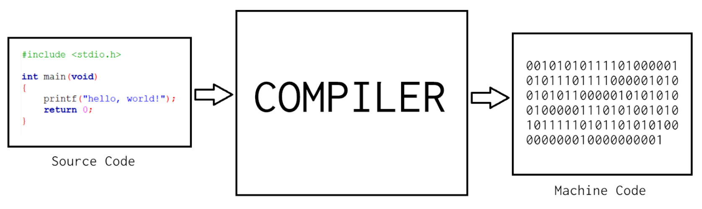
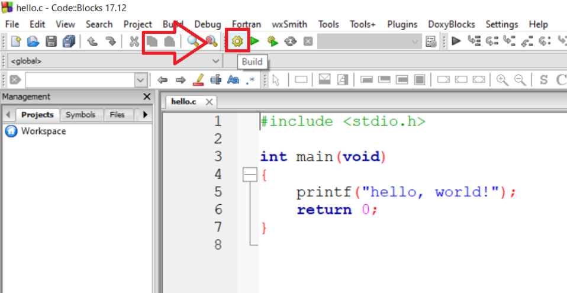
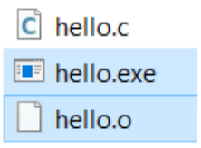
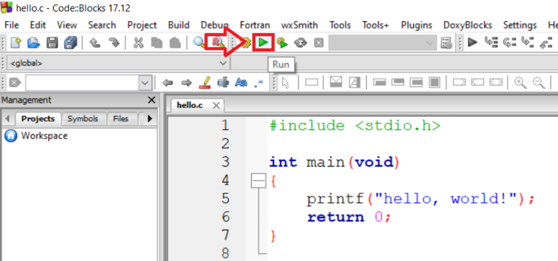
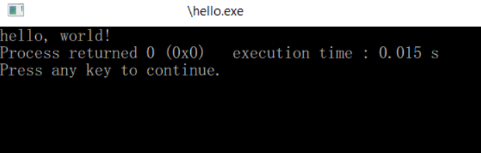
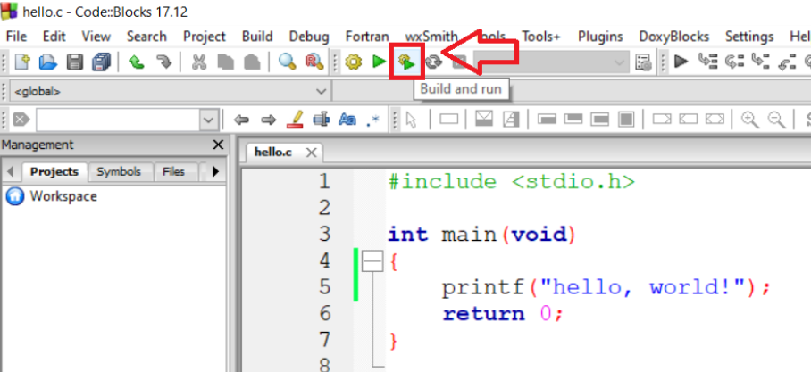
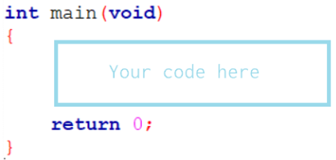
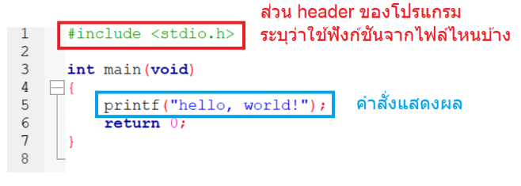

## 1.2 Hello, World!: ปฐมบทแห่งการเขียนโปรแกรม

ก่อนอื่น สร้างไฟล์เปล่า ๆ มาสัก 1 ไฟล์ ลองพิมพ์ตามนี้ แล้วเซฟเป็นไฟล์ `hello.c` ไว้ที่ไหนสักที่ได้เลย

```cpp
#include <stdio.h>
int main(void)
{
    printf("hello, world!");
    return 0;
}
```

---

ยินดีด้วยครับ คุณเขียนโปรแกรมแรกเสร็จแล้ว แต่ว่าสิ่งที่คุณเขียนเป็นแค่ "**Source Code**" ซึ่งมีแค่มนุษย์ที่อ่านได้เท่านั้น[^1] เราจะต้องนำ Source Code ดังกล่าวไปใส่โปรแกรมที่เรียกว่า "**Compiler**" เพื่อทำการ "**compile**" หรือแปลงให้เป็นโปรแกรมที่สามารถเรียกใช้บนคอมพิวเตอร์ได้จริง ๆ ("**executable program**") นั่นเอง

[^1]: ...และตอนนี้คุณก็อ่านไม่ได้

โปรแกรมที่สามารถใช้งานได้จะอยู่ในรูปแบบ "**Machine Code**" ซึ่งเป็นข้อมูลเลขฐาน 2 (เลข 0, 1) ที่กำกับการทำงานของคอมพิวเตอร์ เมื่อเราเปิดโปรแกรม (โดยการ double-click หรืออะไรก็แล้วแต่) ตัวระบบปฏิบัติการก็จะตีความหมายของ Machine Code ดังกล่าวแล้วทำงานตามที่เรากำหนดไว้ แน่นอนว่ามนุษย์ไม่สามารถอ่าน Machine Code ได้ง่าย ๆ



---

ในโปรแกรม CodeBlocks เราสามารถทำการ compile ได้โดยกดปุ่ม Build ทางด้านบน



เมื่อ compile แล้วจะพบว่าในโฟล์เดอร์ที่เก็บไฟล์ `hello.c` ไว้ มีไฟล์เพิ่มมาสองไฟล์ได้แก่ `hello.o` และ `hello.exe`



`hello.o` เป็นเพียงแค่ไฟล์ที่ถูกสร้างขึ้นมาระหว่างการ compile เท่านั้น[^2] ส่วน `hello.exe` ก็คือตัวโปรแกรมของเรานั่นเอง

[^2]: จริง ๆ แล้วคำว่า compile มีขั้นตอนซ่อนอยู่หลายขั้นตอนมาก แต่เราจะไม่เจาะรายละเอียด

---

หากลอง double-click ที่ `hello.exe` จะพบว่าโปรแกรมเปิดขึ้นมาเพียงแค่เสี้ยววินาทีเดียวเท่านั้นแล้วดับไป ทั้งนี้ก็เป็นเพราะว่าโปรแกรมของเราแทบไม่มีอะไรเลย

ถ้าอยากเห็นว่าเกิดอะไรขึ้นในโปรแกรมกันแน่ ให้ใช้วิธีการ **Run** หรือ **Execute** โปรแกรมผ่านทาง Code::Blocks แทน โดยกดปุ่ม Run (สามเหลี่ยมสีเขียว) ตรงด้านบน



จะพบว่าโปรแกรมของเราคือโปรแกรมที่แสดงผลคำว่า `hello, world!` ผ่านทาง command prompt/terminal/console นั่นเอง เย้!



---

ทุกครั้งที่มีการแก้ไขโปรแกรม **จะต้อง compile ใหม่เสมอ** เพื่อให้ไฟล์ `.exe` อัพเดทตาม Source Code ของเรา ทั้งนี้ เพื่อป้องกันการลืม เราสามารถเปลี่ยนมาใช้ปุ่ม **Build and run** แทนได้ ปุ่มนี้จะทำการ compile ให้ก่อนเรา run โปรแกรมทุกรอบ



---

ในการเขียนโค้ดภาษา C นั้น โดยปกติจะมีโครงสร้างที่จำเป็นต้องเขียนตลอดทุกครั้ง ดังนี้



ทุกครั้งที่เราเขียนโปรแกรม เราจะต้องเขียนโครงนี้เสมอ เพื่อให้ compiler รู้ว่าโปรแกรมของเราจะเริ่มต้นตรงไหน (สังเกตว่าส่วนที่เป็นโค้ดของเราเหมือนจะโดนครอบไว้ด้วยเครื่องหมายปีกกา `{` `}` อยู่) ตอนนี้ยังไม่จำเป็นต้องเข้าใจว่าคำว่า `int`, `main`, `void`, `return` ที่ปรากฏแปลว่าอะไร

---

คำสั่งแรกสุดในภาษา C ก็คือคำสั่งแสดงผลข้อความ เรียกว่า      `printf`
เพื่อที่จะแสดงผลคำว่า `hello, world` เราจึงเขียนโค้ดแบบนี้

```cpp
printf("hello, world!");
```

สังเกตว่า
- การเขียนคำสั่งจะคล้ายคลึงกับฟังก์ชันทางคณิตศาสตร์ `f(x)` นั่นคือ ชื่อฟังก์ชันจะอยู่ด้านนอก แล้วมีวงเล็บครอบข้อมูลที่เราต้องการนำไปใส่ในฟังก์ชัน
- คำที่เราต้องการจะแสดงผลจะต้องอยู่ในเครื่องหมาย double quote (`"`) ด้วย เพื่อให้ตัว compiler เข้าใจว่าคำว่า `hello, world` ที่เราเขียนไปเป็นข้อความที่ต้องการให้แสดงผล ไม่ใช่คำสั่งของภาษา C
- ทุกครั้งที่จบคำสั่งจะต้องมี semicolon (`;`) ปิดท้าย

---

ทั้งนี้ ฟังก์ชัน `printf` ก็มีที่มามาจากนิยามในไฟล์ที่ชื่อว่า `stdio.h` (Standard Input/Output)

การที่จะใช้ฟังก์ชันดังกล่าวได้นั้น เราจำเป็นต้องเขียนกำกับไว้ที่หัวโปรแกรมว่าต้องการใช้คำสั่งจากไฟล์ `stdio.h` โดยเขียนว่า `#include <stdio.h>` (จำ ๆ รูปแบบไปก่อน) ดังนั้น โค้ดของเราจึงมีหน้าตาดังนี้



---

เอาล่ะ ลองเขียนโค้ดดูเองบ้าง!

**โจทย์**: จงเขียนโปรแกรมเพื่อแสดงผลคำว่า `I love programming!` แล้วทดลองรันในคอมพิวเตอร์ของตัวเอง

นำโค้ดมาใส่ในกล่องข้างล่างนี้แล้วรันทดสอบเพื่อไปหน้าถัดไป

[code box, compile & run]
